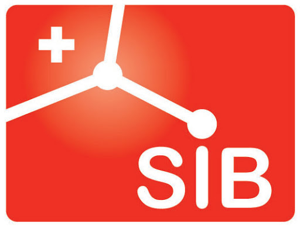

# GLIMPSE
{: .fs-9 .fw-500 }

A tool for low-coverage whole-genome sequencing imputation
{: .fs-5 }

 
 

{: .highlight }
Website under construction. A complete release of GLIMPSE2 will be available by the 5th of December 2022.

## About

[GLIMPSE2](https://www.biorxiv.org/content/10.1101/2022.11.28.518213v1) is a set of tools for low-coverage whole genome sequencing imputation. GLIMPSE2 is based on the <a href="https://www.nature.com/articles/s41588-020-00756-0">GLIMPSE model</a> and designed for reference panels containing hundreads of thousands of reference samples, with a special focus on rare variants. 

## Citation

If you use GLIMPSE in your research work, please cite the following papers:

[Rubinacci et al., Imputation of low-coverage sequencing data from 150,119 UK Biobank genomes. BiorXiv (2022)](https://www.biorxiv.org/content/10.1101/2022.11.28.518213v1)

[Rubinacci et al., Efficient phasing and imputation of low-coverage sequencing data using large reference panels. Nature Genetics 53.1 (2021): 120-126.](https://www.nature.com/articles/s41588-020-00756-0)

[Get started now](#getting-started){: .btn .btn-primary .fs-5 .mb-4 .mb-md-0 .mr-2 .mx-auto }
[View source code on GitHub](https://github.com/odelaneau/GLIMPSE){: .btn .fs-5 .mb-4 .mb-md-0 }

## GLIMPSE1

At the moment, GLIMPSE2 performs imputation only from a reference panel of samples. 
To use the joint-model, particularly useful for many samples at higher coverages (>0.5x) and small reference panels, please visit the [GLIMPSE1 website](https://odelaneau.github.io/GLIMPSE/glimpse1/index.html).

## News

{: .new }
> **Version `2.0.0` will be soon available!**
> See [the CHANGELOG](https://github.com/odelaneau/GLIMPSE/blob/main/docs/CHANGELOG.md) for details.

## Description

GLIMPSE2 is composed of the following tools:

- **chunk**. Tool to phase common sites, typically SNP array data, or the first step of WES/WGS data.
- **split_reference**. Tool to phase common sites, typically SNP array data, or the first step of WES/WGS data.
- **phase**. Ligate multiple phased BCF/VCF files into a single whole chromosome file. Typically run to ligate multiple chunks of phased common variants.
- **ligate**. Tool to phase rare variants onto a scaffold of common variants (output of phase_common / ligate).
- **concordance**. Program to compute switch error rate and genotyping error rate given simulated or trio data.

[chunk]({{site.baseurl}}){: .btn .btn-blue }
[split_reference]({{site.baseurl}}){: .btn .btn-blue }
[phase]({{site.baseurl}}){: .btn .btn-blue }
[ligate]({{site.baseurl}}){: .btn .btn-blue }
[concordance]({{site.baseurl}}){: .btn .btn-blue  }

---

## Getting started

- [See documentation]({{site.baseurl}} )

---

## About the project

GLIMPSE is developed by Simone Rubinacci & Olivier Delaneau.

### License

GLIMPSE is distributed with [MIT license](https://github.com/odelaneau/GLIMPSE/blob/main/LICENSE).

### Organisations

  

  

  

### Contributing

GLIMPSE is an open source project and we very much welcome new contributors. To make the contribution quickly accepted, please first discuss the change you wish to make via issue,
email, or any other method with the owners of this repository before making a change.

#### Thank you to the contributors of GLIMPSE!

<ul class="list-style-none">

  <li class="d-inline-block mr-1">
     
  </li>

</ul>

We thank the [Just the Docs](https://github.com/just-the-docs/just-the-docs) developers, who made this awesome theme for Jekyll.
